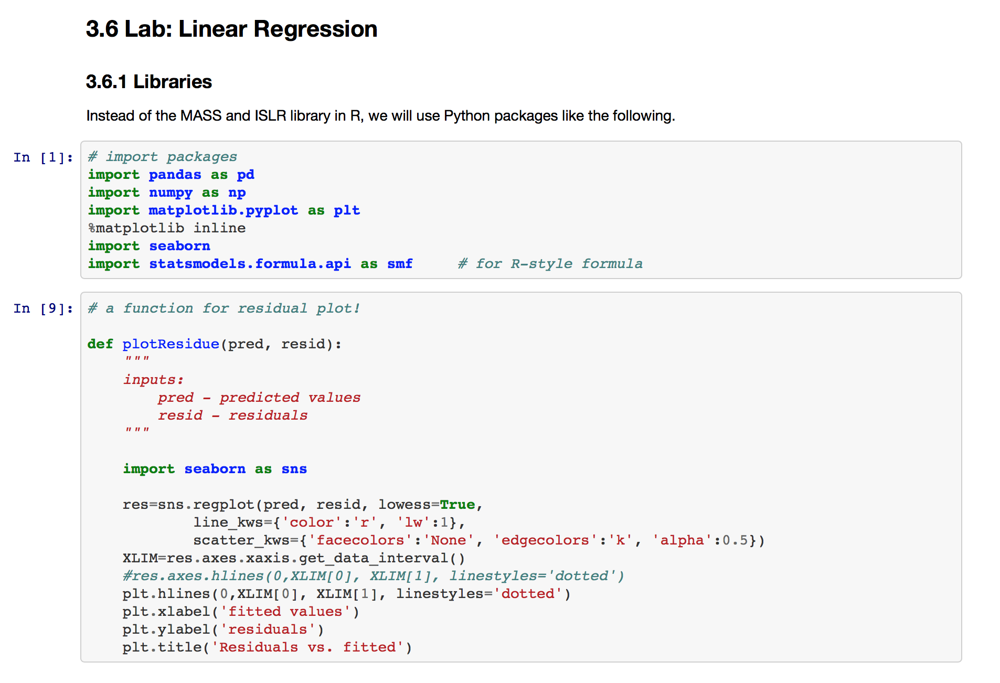

Brief summary of 
1. key concepts and tips for Python programming
2. how to set up Python environment 
3. Jupyter notebooks

# 1. Learning Python language

## Think Python 2nd Edition
Allen Downey's excellent book on Python is strongly recommended.
You can see a free pdf from [here](http://greenteapress.com/wp/think-python-2e/).
Code is [here](https://github.com/AllenDowney/ThinkPython2)

## More on Python 3

There are many good tutorials on the web. 
I found a tuturial in https://www.python-course.eu/python3_course.php very useful for it's simple explanations and numerous figures. 

From the tutorial, let's learn key concepts and practice them.
The following links are what, I believe, you should know to get started. 
### basic
 - [indentation](https://www.python-course.eu/python3_blocks.php)
 - [data types and variables](https://www.python-course.eu/python3_variables.php)
 - [arithmetic and comparison operators](https://www.python-course.eu/python3_operators.php)
### data structure 
 - [list](https://www.python-course.eu/python3_sequential_data_types.php)
 - [list manipulation](https://www.python-course.eu/python3_list_manipulation.php)
 - [copying](https://www.python-course.eu/python3_deep_copy.php)
 - [dictionary](https://www.python-course.eu/python3_dictionaries.php)
 - [set](https://www.python-course.eu/python3_sets_frozensets.php)
### flow control
 - [conditional Statements](https://www.python-course.eu/python3_conditional_statements.php)
 - [loop](https://www.python-course.eu/python3_loops.php)
 - [for loop](https://www.python-course.eu/python3_for_loop.php)
### function
 - [function](https://www.python-course.eu/python3_functions.php)
 - [parameters and arguments](https://www.python-course.eu/python3_passing_arguments.php)
### modules
 - [modules](https://www.python-course.eu/python3_modules_and_modular_programming.php)
 - [packages](https://www.python-course.eu/python3_packages.php)
 
# 2. Setting up Python environment

## python 2 vs 3
Python 2.7 used to be very popular for scientific computing for a long time. 
But now, it's safe to switch to Python 3 (3.5 or 3.6).
So, if you are new to Python, start from Python 3.

If both python 2 and 3 are installed on your machine, you can (should) run python 3 by typing `python3` instead of `python`.
```
python3
```


You can check the version of the python as follows.
```
python --version
```
On Ubuntu 16.04.3, it will be Python 2.7.12.
```
python3 --version
```
On Ubuntu 16.04.3, it will be Python 3.5.2.

## For OSX users
You can install python 3 (and all the other open-source packages) using Mac Port. 

1. Install Mac Port
   https://www.macports.org/install.php
2. Install pythone 3.
  ```bash 
  sudo port install python3
  sudo port install py36-setuptools
  ```
3. As of Sep. 2, 2017, python 3.6 is the latest. You can select it for python3 like this.
  ```
  sudo port select --set python3 python36
  ```

Also, you can keep it updated using the following commands.
```bash
sudo port -v selfupdate
sudo port upgrade outdated
```

See https://www.macports.org for more details.


## virtual environment 
In pythone 3 (from 3.3), `venv` is the standard way for creating and using virtual environments.

You can create a new virtual environment using
```
python3 -m venv [PATH-TO-NEW-VENV]
```
and activate it using
```
source [PATH-TO-NEW-VENV]/bin/activate
```

When you want to leave the current virtual environment, deactivate it.

```bash
deactivate
```

See https://docs.python.org/3/library/venv.html for more information.


## Installing packages using `pip`in an virtual environment (**RECOMMENDED**)

### pip
You can use 'pip' to install python modules.

Here, I assume that you installed pip for python3 and it's name is pip.
You can do it by 
```bash
sudo apt install python3-pip
```
See https://docs.python.org/3/installing/index.html?highlight=pip for more information.


It is quite tricky where the actual modules and librararies are installed. 
In the virtual environment, don't worry about it and just use pip without any options.
(This is another reason why virtual environment is useful and recommended.)

### Example. Install tensorflow **without GPU support**

For example, you can install latest tensorflow as follows.
```bash
pip3 install --upgrade tensorflow
```


### Example. Install tensorflow **with GPU support**

For example, you can install latest tensorflow as follows.
```bash
pip3 install --upgrade tensorflow-gpu
```


Add the following three lines to `~/.bashrc`.
```bash
export PATH=$PATH:/usr/local/cuda/bin
export LD_LIBRARY_PATH=$LD_LIBRARY_PATH:/usr/local/cuda/lib64
export LD_INCLUDE_PATH=$LD_INCLUDE_PATH:/usr/local/cuda/include
```

Log out your account and log in again.

You should be able to import tensorflow in your python.


## Install a package without an virtual environment (**NOT RECOMMENDED**)

If you want to install some module for syetem-wide access, then you could do it in two ways.
1) If you have the admnistrator privilege, you can do something like this.
  ```bash
  sudo pip3 install --upgrade tensorflow
  ```
But, you will face some warning that says ....

2) If you are not an admnistrator, you must install the modules under your home folder with `--user` option. 
  ```bash
  pip3 install --user --upgrade tensorflow
  ```


# 3. Jupyter notebook
Jupyter notebook (previously known as Ipython notebook) is a great tool for interactive data analysis. 


## What is Jupyter?
Jupyter is an interactive and integrated interface for scientific computing. 
Using Jupyter, you can put code, text, plots and even equations in a single document, called *notebook* (*.ipynb).
A notebook looks like this.



Other useful features include:
* You can launch your notebook from (any) web browser on your local machine while real computing is performed on either your own machine or on a remote server.
* You can run block-by-block! This is very useful for debugging.


Another good source is this book [Learning Ipython for Interactive Computing and Data Visualization (2nd ed.)](https://www.packtpub.com/big-data-and-business-intelligence/learning-ipython-interactive-computing-and-data-visualization-sec).


## How to install?
The easest way to install Ipython is to use pip as follows.
```
pip3 install jupyter
```


## How to use it?
You have two options to run and edit Jupyter notebooks.

### on local machine
1. Open an Terminal
2. Go to the folder that contains your notebooks
3. Launch the Jupyter kernel by typing the following command.
```
jupyter notebook
```
4. Open (any) web browser and go to localhost:8888 (Step 3 will usually start Step 4 automatically.)
5. In the web browser, you can run each block by Shift+Enter.


### Launch Jupyter over network 
Jupyter is also very useful to launch the actual computations on a server and control it through a web-brower on your local machine. 
You're going to use two terminals, one for SSL tunneling and the other for launching the Jupyter on a remote server.

1. In a terminal, log in to the server and launch Jupyter notebook.

```bash
ssh [ID]@[SERVER ADDRESS]

[GO TO THE FOLDER YOU'RE WORKING ON] 

jupyter notebook --no-browser
```

2. In a new terminal, establish a SSH tunnel between your local machine and the remote server.

```bash
ssh -N -L localhost:8888:localhost:8888 [ID]@[SERVER ADDRESS]
```
Type your password and keep this window opened.

3. In a web browse and open the address and port (default is 8888) provided by the notebook.


See [here](https://coderwall.com/p/ohk6cg/remote-access-to-ipython-notebooks-via-ssh) for more information.


## Matplotlib issue on Mac OSX ([link](https://stackoverflow.com/questions/2512225/matplotlib-not-showing-up-in-mac-osx))

Add the following line to `~/.matplotlib/matplotlibrc`
```
backend: MacOSX
```


 
